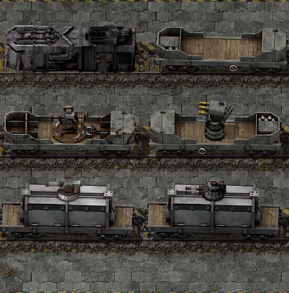

# Armored-train

A fork of [Pandamiami80s](https://mods.factorio.com/user/pandamiami80s)'s [Factorio](https://factorio.com/) Mod [Armored Train (Turret Wagons)](https://mods.factorio.com/mod/Armored-train) to support [Renai Transportation](https://mods.factorio.com/mod/RenaiTransportation)

## Acknowledgments

* [Pandamiami80s](https://mods.factorio.com/user/pandamiami80s) - Credits to the original author of this fantastic mod
* [ZwerOxotnik](https://mods.factorio.com/user/ZwerOxotnik) - Select files borrowed from ZwerOxotnik's excellent [factorio-example-mod](https://github.com/ZwerOxotnik/factorio-example-mod)
* [Kiplacon](https://mods.factorio.com/user/Kiplacon) - Kiplacon's [Renai Transportation](https://mods.factorio.com/mod/RenaiTransportation) mod gave me idea to make Armored-train compatible with it
